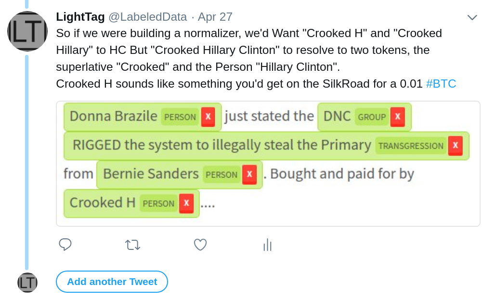

# Trump NER
# Intro
This repo takes data from two excellent NYT articles and puts it in a more structured form. 
Thos articles in question are [The People, Places and Things Trump Has Praised on Twitter: A Complete List](https://www.nytimes.com/interactive/2018/02/14/upshot/trump-compliments-list.html) and [The 459 People, Places and Things Donald Trump Has Insulted on Twitter: A Complete List](https://www.nytimes.com/interactive/2016/01/28/upshot/donald-trump-twitter-insults.html)

Each of these articles catalouges Trumps tweets and highlights phrases that were an insult / compliment. 

## So What is this ?
At [LightTag](https://lighttag.io) we build tools to label text and we couldn't miss an opportunity to promote a wonderful labeled data set. The staf at NYT have hand labeled Trump tweets for (we think) a few years and built quite a wonderful dataset. This repo contains their original annotations as well as our code for making them a a little richer

## Where is this heading
We're using this data to jump start a wider scale, public labeling project where we'll be labeling trump tweets.

