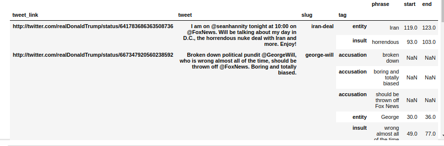

# Trump NER
# Intro
This repo takes data from two excellent NYT articles and puts it in a more structured form. 
The articles in question are [The People, Places and Things Trump Has Praised on Twitter: A Complete List](https://www.nytimes.com/interactive/2018/02/14/upshot/trump-compliments-list.html) and [The 459 People, Places and Things Donald Trump Has Insulted on Twitter: A Complete List](https://www.nytimes.com/interactive/2016/01/28/upshot/donald-trump-twitter-insults.html)

Each of these articles catalouges Trumps tweets and highlights phrases that were an insult / compliment. 
The final data (after our proccessing) looks like this

# Shut up and give me the data
The data, after our modifications is in ny_times_data.csv in this repo. Just glance at the notebook to see what we did. 
## So What is this ?
At [LightTag](https://lighttag.io) we build tools to label text and we couldn't miss an opportunity to promote a wonderful labeled data set. The staf at NYT have hand labeled Trump tweets for (we think) a few years and built quite a wonderful dataset. This repo contains their original annotations as well as our code for making them a a little richer

## Where is this heading
We're using this data to jump start a wider scale, public labeling project where we'll be labeling trump tweets.

We'll be using these annotations to pre-populate a model, which will provide suggestions to our community of annotators. 

# This is a community effort
We're putting this out there with the goal of building a community of "trump annotators", hopefully from all sides of the spectrum. 
Since this is a community effort, we'll be releasing all annotations that come in. You'll find the latest version once a week here. 
Anyone annotating can download the latest data live

# Where do I sign up ? 

Glad you asked. Just go to [our demo page](https://demo.lighttag.io), signup and start labeling 
